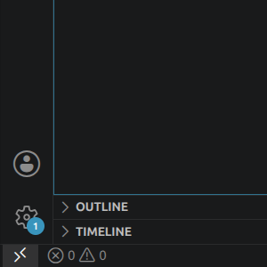

## Raspberry Pi Setup

### Prerequisites
A laptop (preferable running Linux Ubuntu) with:
- [Raspberry Pi Imager](https://www.raspberrypi.com/software/)
- A Raspberry Pi with at least 4GB of RAM (e.g. Pi 4 or Pi 5)
- [VSCode](https://code.visualstudio.com/)

### Steps
Flash Raspberry Pi OS Lite (64 bit) onto the SD card. 
- Configure SSH to be enabled during setup Wizard
- Add the hotspot connection, so that you can `ssh` into the Pi without a monitor.

Login, and take note of I.P. address.


Ensure the Pi is connected to the laptop hotspot wifi.

Note: If Wi-Fi is unavailable, check the wifi configuration:
`sudo raspi-config`
Check 5: Localisation Options

Now, use `nmcli` to connect to the laptop hotspot:

```bash
nmcli device wifi list
sudo nmcli device wifi connect "YOUR_SSID" password "YOUR_PASSWORD"
```
Now, check the newly assigned IP address:
`hostname -I`

You may now SSH into the Pi:

`ssh [username]@[ip address]`

Connection Refused?
- Check if the ssh service is running on the Pi:
`sudo systemctl status ssh`
If the status is inactive (dead), start it using:
`sudo systemctl start ssh`
- Check if the username is correct. It should match the username in the terminal.

Use the [VSCode Remote SSH extension](https://code.visualstudio.com/docs/remote/ssh) for convenience:



Note: Create an SSH key to avoid repeatedly logging in.


Before moving on, check for date issues. Linux will complain about signature verification issues if the date is not correct.
`date`

Set the date manually:
`sudo date -s '2026-06-26 07:25:00'`

Check the status:
`timedatectl status`


Install [Docker Engine](https://docs.docker.com/engine/install/) using the official steps for Linux. 
Note: Pi OS runs on Debian, and use a convenience script to install it in development environment:

```bash
curl -fsSL https://get.docker.com -o get-docker.sh
sudo sh get-docker.sh
```
Give necessary permissions:
```bash
sudo usermod -aG docker $USER
newgrp docker
```

Now, [clone the repository onto the device](/doc/clone_repo.md)


Success! Now go to [build_robot](./build_robot.md) to build the project!